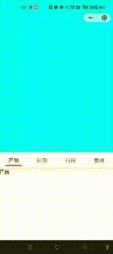

# tabs-sticky
微信小程序原生代码，自定义导航栏+tabs吸顶+锚点

# 效果图

#开发需求说明
1.需求一般用在产品详情页较多。
例如刚进入页面自定义导航栏为空（图一），
当滑动到tabs吸顶后自定义导航栏出现（图二），
tab点击锚点跳转。

2.使用scroll-view 跟 scroll-into-view，虽然可以完成锚点跳转，但是会页面锚点直接顶到顶部。

3.参考过其它tabs吸顶，无法完成该需求。

#API文档
最低基础库：2.23.1

[wx.pageScrollTo](https://developers.weixin.qq.com/miniprogram/dev/api/ui/scroll/wx.pageScrollTo.html)

[wx.createSelectorQuery](https://developers.weixin.qq.com/miniprogram/dev/api/wxml/wx.createSelectorQuery.html)

#转载请附上原文出处链接及声明
[https://github.com/Dgg1997/tabs-sticky](https://github.com/Dgg1997/tabs-sticky)